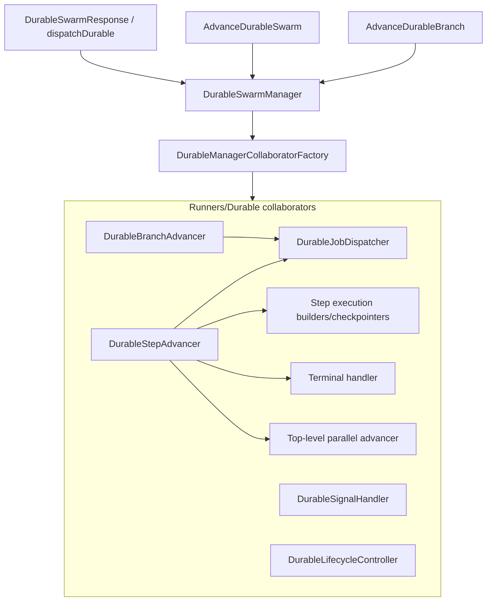

# Durable Runtime Architecture

This guide maps **how durable execution is implemented in PHP** so you can operate, test, and extend it confidently. It complements [Durable Execution](durable-execution.md), which focuses on **when and why** to use `dispatchDurable()` and how persistence behaves.

## Audience

- **Application developers** wiring operator UIs, webhooks, or admin tools against `DurableSwarmManager` and `DurableRunStore`.
- **Contributors** changing step advancement, branches, recovery, or signals—without breaking the single graph contract described below.
- **Test authors** writing database-backed feature tests that need to observe or stub durable job dispatch.

## Mental model

1. **`dispatchDurable()`** creates a `DurableSwarmResponse` with a `runId` and dispatches the first checkpoint job. Your swarm class remains the public API for starting work.
2. **`DurableSwarmManager`** is the **stable application entry point** for everything that happens *after* dispatch: pause, resume, signals, waits, inspection, child swarms, and the `advance` / `advanceBranch` hooks used by queue jobs.
3. **Collaborators** under `src/Runners/Durable/` hold focused logic. The manager delegates to them; it should not grow new monolithic behavior.
4. **`DurableManagerCollaboratorFactory`** is the **only** supported way to construct the full collaborator graph. It builds **one** `DurableRunContext` and **one** `DurablePayloadCapture` and injects those same instances into every collaborator so checkpoints, capture, and signals stay coherent.



## Stable surface: `DurableSwarmManager`

Resolve the manager from the container when your code needs to interact with a run that already exists (operators, HTTP controllers, queued application jobs):

```php
use BuiltByBerry\LaravelSwarm\Runners\DurableSwarmManager;

$manager = app(DurableSwarmManager::class);
```

### Operations exposed on the manager

| Area | Methods |
|------|---------|
| **Start** (used when dispatching durable) | `start()` — normally reached via swarm `dispatchDurable()`, not called directly from app code. |
| **Inspection** | `find()`, `inspect()`, `inspectByLabels()`, `updateLabels()`, `updateDetails()`, `recordProgress()` |
| **Waits and signals** | `wait()`, `signal()` |
| **Child swarms** | `dispatchChildSwarm()` |
| **Lifecycle** | `pause()`, `resume()`, `cancel()`, `recover()`, `updateQueueRouting()` |
| **Queued hierarchical coordination** | `enterQueueHierarchicalParallelCoordination()` — internal coordination between `queue()` hierarchical runs and durable storage; not a general-purpose app API. |
| **Job advancement** | `advance()`, `advanceBranch()` — invoked by `AdvanceDurableSwarm` and `AdvanceDurableBranch`; treat as execution plumbing unless you are writing custom jobs. |
| **Testing hooks** | `afterStepCheckpointForTesting()`, `beforeStepCheckpointForTesting()`, `afterChildIntentForTesting()` — documented as internal in source; used by the package test suite for crash windows. |

Behavioral guarantees (leases, checkpoints, recovery, hierarchical joins) are described in [Durable Execution](durable-execution.md) and the topic guides linked from there.

## Queue jobs and job dispatch

Each durable step is processed by a normal Laravel queue job:

| Job | Invokes |
|-----|---------|
| `BuiltByBerry\LaravelSwarm\Jobs\AdvanceDurableSwarm` | `$manager->advance($runId, $stepIndex)` |
| `BuiltByBerry\LaravelSwarm\Jobs\AdvanceDurableBranch` | `$manager->advanceBranch($runId, $branchId)` |

**Dispatching** the next job (correct connection, queue, and job class) is centralized in `BuiltByBerry\LaravelSwarm\Runners\Durable\DurableJobDispatcher`. Collaborators call into it when a checkpoint completes and another step or branch must run.

If you need to **record or stub dispatches** in tests, bind `DurableJobDispatcher` in the container before resolving `DurableSwarmManager`. The package’s own feature tests use that pattern; see `tests/Feature/DurableSwarmTest.php` for a working example.

## Collaborator responsibilities

These classes live in `BuiltByBerry\LaravelSwarm\Runners\Durable\` unless noted.

| Class | Role |
|-------|------|
| `DurableManagerCollaboratorFactory` | Builds the full graph; **@internal** — not an extension point. |
| `DurableManagerCollaborators` | Simple DTO holding factory output references for the manager constructor. |
| `DurableRunContext` | Shared reload/save helpers and run-scoped coordination for the graph. |
| `DurablePayloadCapture` | Capture/redaction helpers shared across handlers. |
| `DurableSwarmStarter` | Run row creation and initial dispatch when a durable run starts. |
| `DurableJobDispatcher` | Builds and returns `PendingDispatch` for step and branch jobs; dispatches queued hierarchical resume when configured. |
| `DurableSignalHandler` | Signals, waits, and outcomes that release the run. |
| `DurableRetryHandler` | Retry policy evaluation and scheduling metadata. |
| `DurableRunInspector` | `find` / `inspect*` / labels / details / progress persistence. |
| `DurableLifecycleController` | Pause, resume, cancel, queue routing updates. |
| `DurableRecoveryCoordinator` | `recover()` scan and redispatch semantics. |
| `DurableBoundaryCoordinator` | Declarative waits and child-swarm boundary entry after checkpoints. |
| `DurableChildSwarmCoordinator` | Child durable dispatch and parent wait reconciliation. |
| `DurableBranchCoordinator` / `DurableBranchAdvancer` | Durable branch lifecycle, worker execution, and branch terminal checkpointing. |
| `DurableStepAdvancer` | Lease-owned coordinator for `advance()`; delegates execution setup, topology-specific advancement, checkpoints, and terminal transitions. |
| `DurableStepExecutionBuilder` | Resolves the swarm, marks the run running, dispatches `SwarmStarted`, and builds the shared `SwarmExecutionState`. |
| `DurableSequentialStepAdvancer` | Executes one sequential durable step through `SequentialRunner`. |
| `DurableTopLevelParallelAdvancer` | Top-level parallel branch fan-out, branch-wait checkpointing, joins, partial-success policy, and terminal delegation. |
| `DurableStepCheckpointCoordinator` | Successful post-step checkpointing, testing checkpoint hooks, durable boundary entry, and next step/branch dispatch. |
| `DurableRunTerminalHandler` | Durable timeout, cancel, pause, failure, branch-failure, completion, lifecycle event, and child-run terminal reconciliation paths. |
| `DurableHierarchicalCoordinator` | Waiting parent / join dispatch at hierarchical boundaries. |
| `QueuedHierarchicalDurableCoordinator` | Bridge for `multi_worker` queued hierarchical parallel coordination. |
| `DurableRunRecorder` | `src/Runners/DurableRunRecorder.php` — checkpoint persistence helper used by the advancers. |

## Container registration rules

`SwarmServiceProvider` documents rules that prevent subtle bugs (double capture, wrong `DurableRunContext` instance, stale singletons):

- **`DurableSwarmManager`** and **`DurableManagerCollaboratorFactory`** are singletons.
- **`DurableJobDispatcher`** and most collaborators are **bound transiently** — a new instance when resolved, but the **manager** always receives the graph built once per manager construction via the factory.
- **`DurableSignalHandler`**, **`DurableRetryHandler`**, and **`DurableRunInspector`** are **not** registered on the container. They must only exist as part of the factory-built graph.
- **`DurableRunRecorder`** is bound (not singleton) so tests can replace it **before** the first `DurableSwarmManager` resolution; the factory passes the shared `DurableRunContext` into `makeWith` when constructing the recorder.

When writing **unit tests** for a single collaborator, use `$this->app->makeWith(...)` with explicit constructor parameters rather than assuming a global singleton exists for types marked “built only inside the factory.”

## Persistence boundaries

- **`DurableRunStore`** (`DatabaseDurableRunStore`) is the contract for durable **rows** and related operational tables. Application dashboards often call `DurableRunStore::find()` directly for read-mostly operational JSON; writes during a run go through the manager graph.
- **Context, history, and artifacts** use `ContextStore`, `RunHistoryStore` (database implementation), and `ArtifactRepository` — the advancers and recorder coordinate updates with the durable cursor.

See [Persistence And History](persistence-and-history.md) for the inspection story across execution modes.

## Topic guides and the graph

These guides describe **behavior** from an application perspective; internally they map to the collaborators above:

- [Durable Waits And Signals](durable-waits-and-signals.md)
- [Durable Retries And Progress](durable-retries-and-progress.md)
- [Durable Child Swarms](durable-child-swarms.md)
- [Durable Webhooks](durable-webhooks.md)

## Testing

- **Fakes**: `Swarm::fake()` / `assertDispatchedDurably()` are ideal for application flow tests that do not need the database durable pipeline.
- **Real durable pipeline**: use feature-style tests with database migrations, a queue driver you control (`sync` or `Bus::fake()` with manual handling), and—when you need to assert **which** step jobs were queued—a test double for `DurableJobDispatcher` as in the package feature suite.

Full guidance lives in [Testing](testing.md#database-backed-durable-execution).

## Upgrade note: methods removed from `DurableSwarmManager`

Older releases exposed `create()`, `dispatchStepJob()`, and `dispatchBranchJob()` on the manager. Those have been **removed** in favor of internal use of `DurableRunStore::create()` at start time and `DurableJobDispatcher` for job construction. Applications should not need to create durable rows or dispatch step jobs manually; if you do, call the store or dispatcher explicitly and read [UPGRADING.md](../UPGRADING.md).

---

**Summary:** Use **`DurableSwarmManager`** from application code, **`DurableRunStore`** for direct operational reads, and the **factory-built graph** only through the manager or documented test bindings. That keeps durable execution predictable as the implementation evolves.
