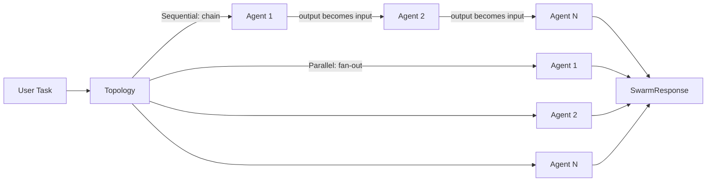

# Introduction to Laravel Swarm

## What Is Laravel Swarm?

Building a workflow that involves more than one AI model call requires coordinating
things Laravel does not handle out of the box: passing outputs between agents,
deciding which agents run and in what order, handling failures mid-run, executing
work in the background, streaming tokens to a browser, and recovering a workflow
after a server restart. Doing this ad hoc—manual prompt chaining, custom queued
jobs, scattered state management—results in code that is hard to test, hard to
operate, and hard to change. Laravel Swarm replaces that with a declarative model:
you define which agents belong to a swarm and which topology governs their
relationship, and the package handles the coordination, execution, and failure paths.

Laravel Swarm is built directly on `laravel/ai`, the official Laravel package for
single-agent LLM interactions. It does not replace Laravel AI; it composes on top
of it, turning single-agent primitives into multi-agent workflows. Because it
follows Laravel conventions throughout—the same execution verbs, the same
attribute-based configuration, the same fake/assertion testing patterns—a developer
already familiar with Laravel AI can read a swarm class and understand it without
consulting documentation. Swarms integrate with Laravel queues, events, broadcasting
channels, and Pulse, so observability and operational tooling plug in using the
infrastructure your application already has.

---

## The Three Concepts

Everything in Laravel Swarm is built around three ideas:

- **Agent.** A single AI model call, defined using `laravel/ai`. Agents are the
  units of work. Laravel Swarm does not own agent definitions; it orchestrates
  agents you have already built.

- **Topology.** The pattern that governs how agents in a swarm relate to each
  other—whether they run in sequence, in parallel, or according to a routing plan.
  You declare a topology with a PHP attribute on your swarm class. The package
  enforces the rules that topology implies.

- **Execution mode.** How the swarm is invoked. The same swarm class can be run
  synchronously, dispatched to a queue, streamed to an HTTP response, or executed
  durably with checkpointing and operator controls, depending on which method you
  call.

---

## How a Swarm Runs

The diagram below shows the general flow. A user task enters the swarm through a
topology, which routes work to one or more agents. All agent outputs are collected
into a `SwarmResponse` returned to the caller.

In a **sequential** topology the path is linear: Agent 1's output becomes Agent 2's
input, and so on down the chain. In a **parallel** topology the path is a fan-out:
every agent receives the original task and runs concurrently, and all results are
collected. Hierarchical topologies add a routing layer between the task and the
workers, described in the next section.

---

## When To Use Laravel Swarm

Use Laravel Swarm when any of the following apply:

- You need more than one agent call in a single workflow.
- You need background (queued) execution of a multi-agent pipeline.
- You need to stream tokens from an agent chain to a browser or client in real time.
- You need durable execution: a workflow that checkpoints its progress, recovers
  after a server restart or job failure, and supports pause, resume, and cancel
  from your application or console.
- You want a consistent fake and assertion layer across all of these execution modes
  for testing.

Use a raw `laravel/ai` agent call when you have a single model call with no
orchestration—one agent, one response, no pipeline.

---

## The Four Topologies at a Glance

- **Sequential** — agents run in a fixed chain; each agent receives the previous
  agent's output as its input. Best for pipelines where each step refines or
  transforms the previous result. See [Sequential Topology](sequential.md).

- **Parallel** — all agents receive the same original task and run concurrently;
  results are collected into a single response. Best for independent research,
  validation, or generation tasks that do not depend on each other.
  See [Parallel Topology](parallel.md).

- **Hierarchical** — a coordinator agent runs first, reads the task, and returns a
  dynamic route plan that determines which worker agents execute and in what order.
  No route plan is written in code; the coordinator LLM decides at runtime.
  See [Hierarchical Routing](hierarchical-routing.md).

- **Static Hierarchical** — a developer-defined route plan (written in PHP) controls
  the execution graph at class-definition time; no coordinator LLM call is made.
  Use this when the routing logic is deterministic and you want the reliability and
  cost profile of a fixed graph. See [Static Hierarchical Topology](static-hierarchical-topology.md).

---

## The Six Execution Modes at a Glance

- **`prompt()`** — synchronous execution; blocks until the swarm completes and
  returns a `SwarmResponse` directly.

- **`run()`** — alias for `prompt()`, retained for compatibility with code written
  before `prompt()` was the primary verb.

- **`queue()`** — dispatches the swarm to a Laravel queue worker; the caller
  receives a `QueuedSwarmResponse` immediately and the run completes in the
  background. No streaming and no checkpointing.

- **`stream()`** — sequential swarms only; returns a lazy `StreamableSwarmResponse`
  that emits typed token events as the final agent produces output. Supports
  in-memory and persisted replay.

- **`broadcast()` / `broadcastOnQueue()`** — stream events are broadcast over
  Laravel broadcasting channels as they are emitted, so browser clients can
  subscribe via websockets or SSE without an open HTTP connection to the PHP process.

- **`dispatchDurable()`** — database-backed execution with a durable cursor;
  the swarm advances through checkpointed jobs, survives server restarts, and
  exposes pause, resume, and cancel controls from both Artisan and your application
  code. See [Durable Execution](durable-execution.md).

---

## Where To Start

Choose based on what you need to accomplish:

- **I want to build a multi-step AI pipeline where each step refines the last.**
  - Start with [Sequential Topology](sequential.md).

- **I want to run agents in the background without blocking the HTTP response.**
  - Read the queue section in [Execution Modes](../README.md#queueing-a-swarm).

- **I need real-time token streaming to a browser or SSE client.**
  - Read [Streaming](streaming.md).

- **I need the workflow to survive server restarts, job failures, or long wait periods.**
  - Read [Durable Execution](durable-execution.md).

- **I need an agent to decide dynamically which workers should run.**
  - Read [Hierarchical Routing](hierarchical-routing.md).

- **I need a fixed execution graph without an LLM making routing decisions.**
  - Read [Static Hierarchical Topology](static-hierarchical-topology.md).

---

## First Paths by Audience

**Novice developer — new to multi-agent AI:**
Introduction (this page) → [Sequential Topology](sequential.md) →
[Execution Modes](../README.md#running-a-swarm) → [Testing](testing.md)

**Senior engineer evaluating the package:**
Introduction (this page) → [Execution Modes](../README.md#running-a-swarm) →
[Public Surface Coverage](public-surface.md) → [Audit Evidence Contract](audit-evidence-contract.md)

**CTO or architect assessing operational and compliance fit:**
Introduction (this page) → [Execution Modes](../README.md#running-a-swarm) →
[Durable Execution](durable-execution.md) → [Maintenance](maintenance.md) →
[Audit Evidence Contract](audit-evidence-contract.md)
